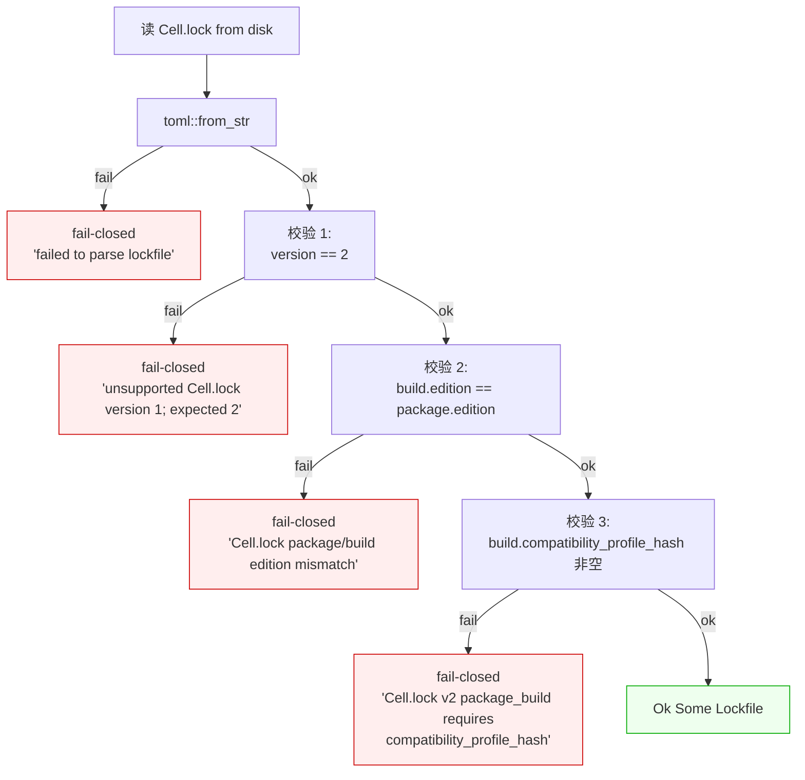
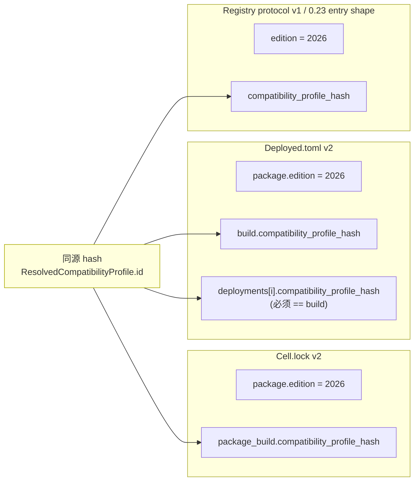
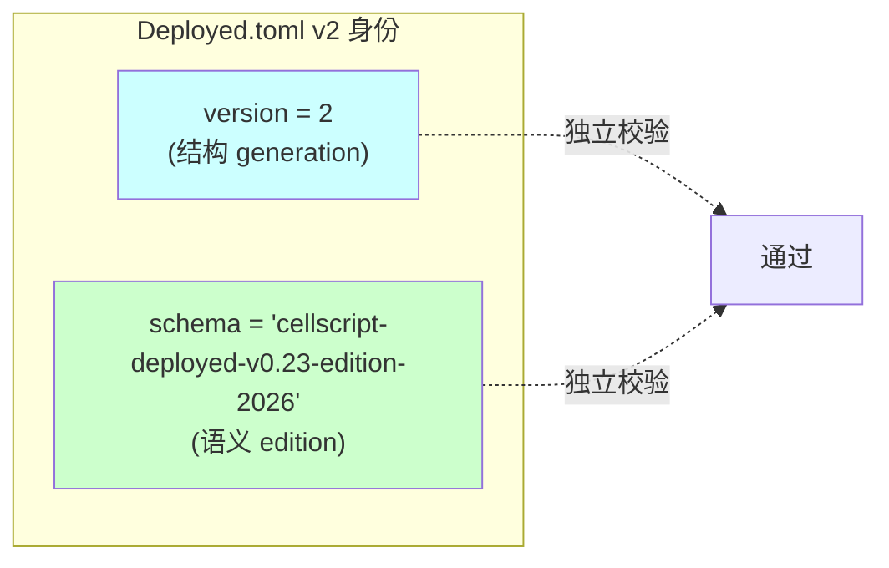
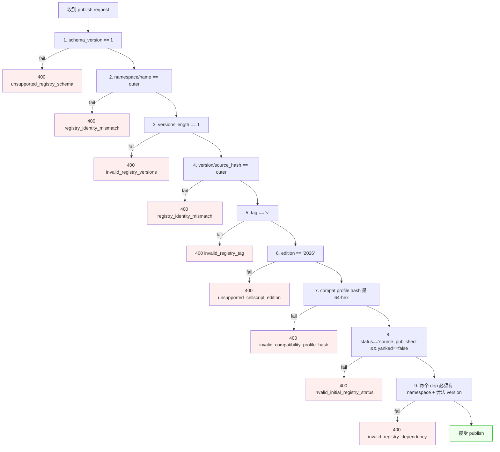
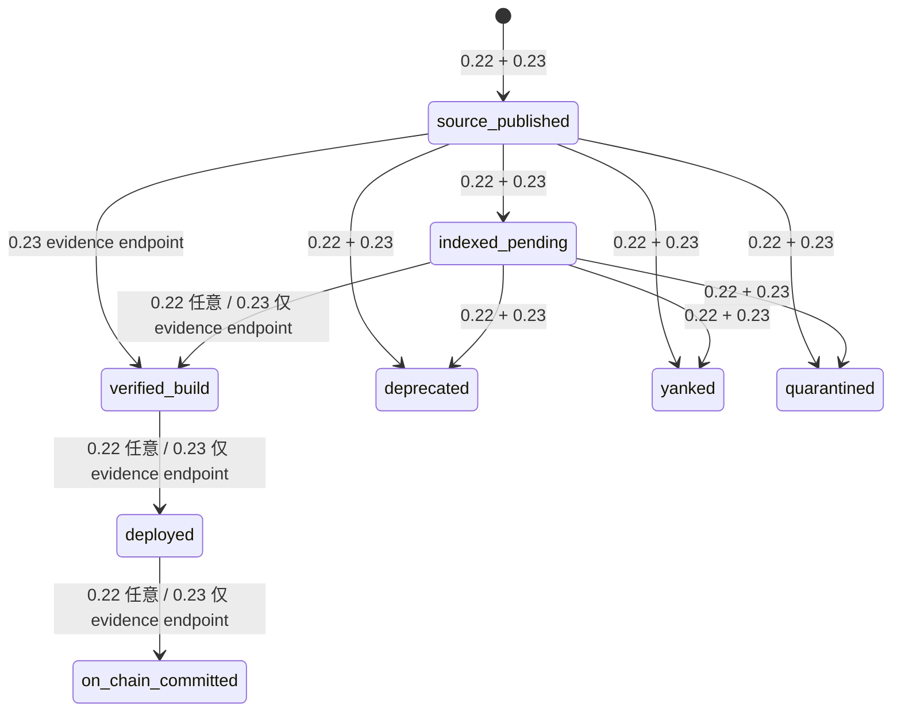
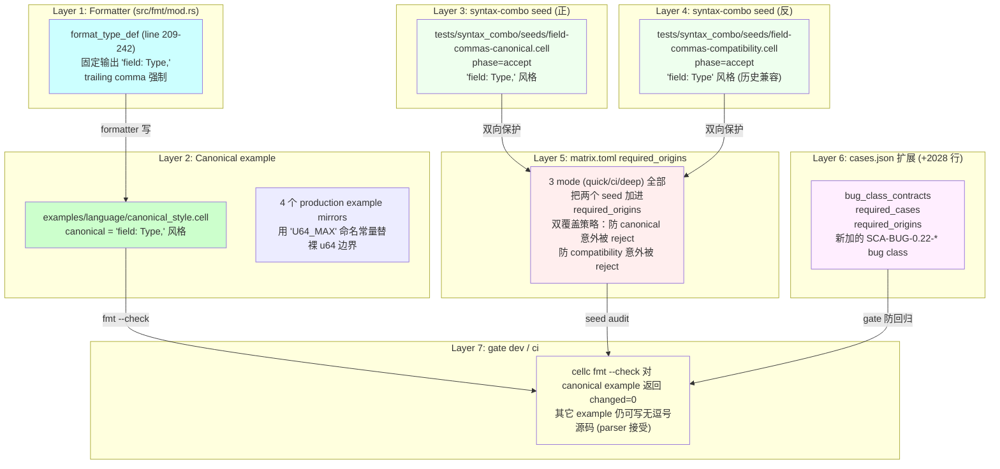
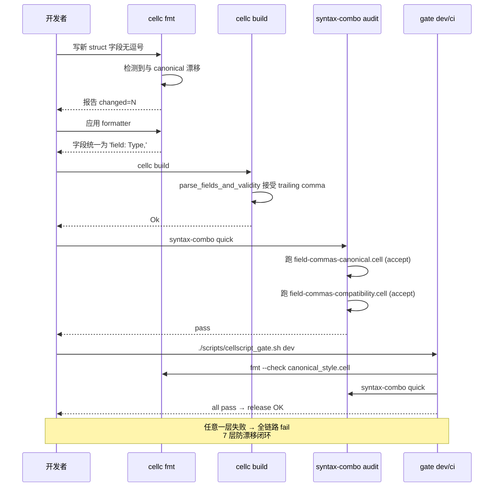
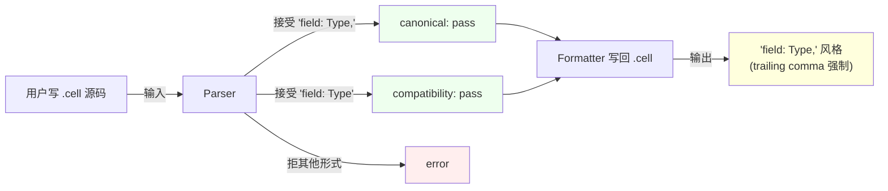
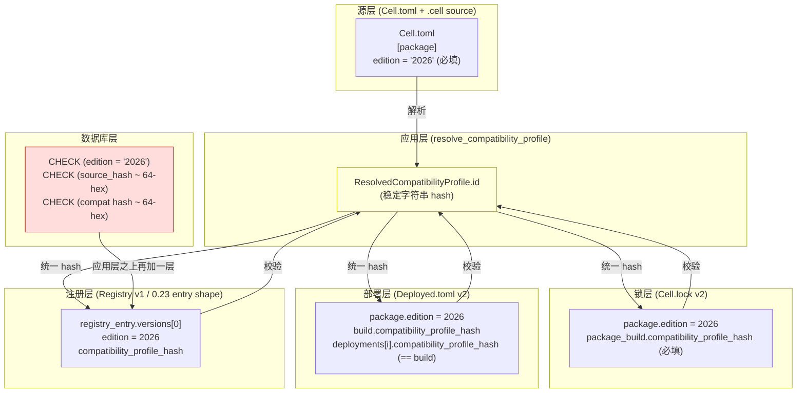

# CellScript 0.23 关键改动深度阐述

> 工作区: `/Users/arthur/RustroverProjects/CellScript`
> 涵盖: 闭集强制概念 + Cell.lock v2 + Deployed.toml v2 + Registry v1 的 0.23 强类型契约 + 风格治理（带 mermaid）
> 写于: 2026-07-31

---

## 1. 「闭集强制」是什么意思

### 1.1 字面意思

**闭集（closed set）** = enum 的所有变体在编译期穷举，**没有「通配」、「未识别」、「其它」分支**。

`src/edition.rs:11-15`:

```rust
pub enum CellScriptEdition {
    #[serde(rename = "2026")]
    Edition2026,
}
```

这个 enum **只有 1 个变体**。不是「2025 / 2026 / 2027 / 0.22 / 0.23 / experimental」枚举，**就是 1 个值**。

`src/edition.rs:78-84` 的 `FromStr`：

```rust
match value {
    "2026" => Ok(Self::Edition2026),
    other => Err(CompileError::without_span(format!(
        "unsupported CellScript edition '{}'; expected 2026", other
    ))),
}
```

任何不是 `"2026"` 的字符串 → **直接编译错误**。没有兼容回退、没有 deprecation warning、没有「unsupported edition, using default」兜底。

`src/edition.rs:106-110` 的测试明确钉死：

```rust
fn only_edition_2026_is_accepted() {
    assert_eq!("2026".parse::<CellScriptEdition>().unwrap(), CellScriptEdition::Edition2026);
    assert!("unsupported".parse::<CellScriptEdition>().unwrap_err().message.contains("expected 2026"));
}
```

### 1.2 「强制」体现在哪里

「强制」不是 enum 本身的属性，是**这个 enum 在整个工具链里被多少地方堵死**：

| 强制点 | 落地位置 | 行为 |
|---|---|---|
| `Cell.toml` 解析 | `src/package/mod.rs:32` `pub edition: CellScriptEdition` | 必填字段，缺 `edition` 直接 deserialize 失败 |
| `Cell.toml` 字符串匹配 | `FromStr` 拒绝任何非 `2026` | `"unsupported CellScript edition 'XYZ'; expected 2026"` |
| `Cell.lock v2` 校验 | `src/package/mod.rs:1108-1114` `validate_schema()` | 读 v1 lock → `unsupported Cell.lock version 1; expected 2` |
| `Deployed.toml v2` 校验 | `src/package/mod.rs:1568-1609` | build/deployment edition 必须等于 package edition |
| `Registry` 服务端 | `services/registry-api/migrations/0001_initial.sql:90-127` | DB CHECK `edition = '2026'` 硬保证 |
| `Registry` 协议 schema | `domain.ts:407-417` | `published["edition"] !== CELLSCRIPT_EDITION` → 400 reject |
| `Cargo.lock` 通过源码 import | 13 个 example Cell.toml 全部 `edition = "2026"` | gate dev / ci 读 example 时如果缺 edition → fail |
| 工具链发布 gate | `scripts/cellscript_gate.sh` | 校验 Cell.lock v2 / Deployed.toml v2 / Registry protocol v1 的 0.23 schema 约束 |
| **没有** migration 路径 | CHANGELOG 明确 "no migration or compatibility reader is provided" | 用户升 0.23 必须删旧 lock / deployed manifest |

**8 个强制点 + 1 个「故意不提供迁移」** = **真正的 fail-closed**。

### 1.3 为什么要做闭集

| 备选设计 | 后果 |
|---|---|
| **开放 enum**（`2024`/`2025`/`2026`/`experimental`）| 0.22 现状——没有 edition 字段，自由字符串，doc 与代码漂移 |
| **字符串字段**（`edition: String`，任意值）| 0.22 现状——写 `edition = "2027"` 也通过，无校验 |
| **闭集 enum + 强校验**（0.23 实际）| 任何「不是 2026」的输入都 fail 在最早期（deserialize / FromStr / DB CHECK）|
| **半闭集 enum + default**（比如 `default = "2026"`）| 用户写错（`edition = "206"`）会静默 fallback 到 2026，掩盖 typo |

0.23 选「闭集 + 强校验 + 故意不提供迁移」= **让"我以为我在用 2026 实际不是" 这种 silent bug 在生产链上没有存活空间**。

代价：升级时所有老 lock / deployed manifest 必须重新生成。

### 1.4 闭集强制的「副作用链」——为什么 edition 牵动那么多 schema

`src/edition.rs:33-58` 的 `resolve_compatibility_profile()`：

```rust
pub fn resolve_compatibility_profile(
    edition: CellScriptEdition,
    target_profile: &str,
    primitive_assurance: Option<&str>,
) -> ResolvedCompatibilityProfile {
    // ... 把 edition + target + assurance + ABI + 4 个 metadata schema version
    //     拼成一个稳定字符串 ID
    let id = format!(
        "{}-{}-target-{}-primitive-{}-entry-{}-placement-{}-metadata-{}-{}-{}-{}",
        COMPATIBILITY_PROFILE_SCHEMA,
        source_semantics,
        target_profile, primitive_assurance,
        crate::ENTRY_WITNESS_ABI,          // "cellscript-entry-witness-v1"
        crate::ENTRY_WITNESS_PLACEMENT_ABI, // "cellscript-witnessargs-input-type-v2"
        crate::METADATA_SCHEMA_VERSION,
        crate::SOURCE_METADATA_SCHEMA_VERSION,
        crate::ARTIFACT_METADATA_SCHEMA_VERSION,
        crate::CONSTRAINTS_METADATA_SCHEMA_VERSION,
    );
    // ...
}
```

闭集强制把"源语言 edition" 与 "target / assurance / ABI / metadata schema" 5 个独立版本轴**显式拼成一个 hash-able 字符串 ID**——这个 ID 是 `Cell.lock` / `Deployed.toml` / `RegistryIndex` 三件套共享的**事实身份**。

```mermaid
flowchart LR
    E[CellScriptEdition<br/>2026 闭集] --> P[ResolvedCompatibilityProfile]
    T[target_profile<br/>ckb / fiber] --> P
    A[primitive_assurance<br/>0.16 / 0.17] --> P
    P --> ID["id (stable string)<br/>cellscript-resolved-compatibility-profile-v1<br/>-cellscript-source-semantics-2026<br/>-target-ckb-primitive-0.16<br/>-entry-cellscript-entry-witness-v1<br/>-placement-cellscript-witnessargs-input-type-v2<br/>-metadata-{4 个 schema version}"]
    ID --> CL[Cell.lock v2<br/>package_build.compatibility_profile_hash]
    ID --> DT[Deployed.toml v2<br/>build/deployments[].compatibility_profile_hash]
    ID --> RI[RegistryIndexEntry<br/>compatibility_profile_hash]
    ID --> DB[(DB CHECK<br/>source_hash 64-hex<br/>manifest_hash 64-hex<br/>compatibility_profile_hash 64-hex<br/>edition='2026')]

    style E fill:#fee,stroke:#c00
    style P fill:#efe,stroke:#0a0
    style ID fill:#eef,stroke:#00c
```

**关键观察**：

- edition 是闭集（`2026` 单值），但 `ResolvedCompatibilityProfile` 把 **5 个独立版本轴** 拼成 1 个 hash
- Cell.lock / Deployed.toml / Registry 三件套共享同一 `compatibility_profile_hash` → **任意一个变化 → 三个文件全部失效**
- DB 在 schema 层（CHECK 约束）独立硬约束 `edition='2026'` → 即使应用层 bug 写错 edition 也写不进 DB

**闭集强制不是「锁一个字符串」，是「锁 5 个独立版本轴的联合身份」**。

---

## 2. Cell.lock v1 → v2 变化

### 2.1 数据结构变化

**位置**：`src/package/mod.rs:1031-1080`

```rust
pub const CURRENT_VERSION: u32 = 2;  // v1 → v2

pub struct Lockfile {
    pub version: u32,                  // 1 → 2
    pub package: LockfilePackageInfo,  // 加 edition
    pub dependencies: BTreeMap<String, LockedDependency>,
    pub package_build: Option<LockedBuildInfo>,  // 0.22 可能没有 → 0.23 必填带 edition + compat hash
    pub deployment: BTreeMap<String, LockfileDeploymentRef>,
}

pub struct LockfilePackageInfo {
    pub edition: CellScriptEdition,    // ← 0.22 没有，0.23 必填
    pub name: String,
    pub version: String,
    pub namespace: Option<String>,
    pub source_hash: Option<String>,
    pub compiler_source_hash: Option<String>,
}
```

### 2.2 校验链（v2 新增）

`src/package/mod.rs:1108-1127` `validate_schema()`：

```rust
pub fn validate_schema(&self) -> Result<()> {
    // 校验 1: version 必须 = 2
    if self.version != Self::CURRENT_VERSION {  // 1 ≠ 2 → reject
        return Err(CompileError::without_span(format!(
            "unsupported Cell.lock version {}; expected {}",
            self.version, Self::CURRENT_VERSION
        )));
    }
    // 校验 2: build edition 必须 = package edition
    if let Some(build) = &self.package_build {
        if build.edition != self.package.edition {
            return Err(...);
        }
        // 校验 3: build 必须带 compat profile hash
        if build.compatibility_profile_hash.is_empty() {
            return Err(...);
        }
    }
    Ok(())
}
```

### 2.3 真实 diff（举 atomic_swap）

0.22 `Cell.lock`（推测形态）：
```toml
version = 1

[package]
name = "atomic_swap"
version = "0.1.0"
source_hash = "0xabc..."
compiler_source_hash = "0xdef..."

[dependencies.token]
version = "0.1.0"
source = "local"

[deployment.testnet]
record = "ckb-..."
code_hash = "0x..."
```

0.23 `Cell.lock` 必填形态：
```toml
version = 2

[package]
edition = "2026"              # ← 新增
name = "atomic_swap"
version = "0.1.0"
source_hash = "0xabc..."
compiler_source_hash = "0xdef..."

[package_build]               # ← 新增（可 Option，但写了就强校验）
edition = "2026"              # ← 必须 == package.edition
compatibility_profile_hash = "0x1234..."  # ← 必填 64-hex

[dependencies.token]
version = "0.1.0"
source = "local"

[deployment.testnet]
record = "ckb-..."
code_hash = "0x..."
```

### 2.4 4 道校验闸



### 2.5 跨三件套的兼容性

Cell.lock v2 不是独立 schema，它跟 Deployed.toml v2 / Registry protocol v1 的 0.23 schema **共享同一 `compatibility_profile_hash`**：



**含义**：如果用户改 `target_profile`（从 ckb 改 fiber），`compatibility_profile_hash` 变 → 3 个 schema 都 reject 当前文件 → **用户必须重 build / 重 deploy / 重 publish**。

这是「让"build 时用 2026, deploy 时用 2027" 这种 silent drift 没有存活空间」的硬约束。

---

## 3. Deployed.toml v1 → v2 变化

### 3.1 数据结构变化

**位置**：`src/package/mod.rs:1529-1612`

```rust
pub const DEPLOYED_MANIFEST_SCHEMA: &str = "cellscript-deployed-v0.23-edition-2026";

pub struct DeployedManifest {
    pub version: u32,                // 1 → 2
    pub schema: String,              // ← 0.22 Option<String>，0.23 必填，== DEPLOYED_MANIFEST_SCHEMA
    pub package: DeployedPackageInfo,  // 加 edition
    pub build: Option<DeployedBuildInfo>,  // 加 edition + compat profile hash
    pub deployments: Vec<DeploymentRecord>,  // 每个加 edition + compat profile hash
}

pub const CURRENT_VERSION: u32 = 2;
```

### 3.2 校验链（v2 新增，**比 Cell.lock v2 更严**）

`src/package/mod.rs:1568-1609` `validate_schema()`：

```rust
pub fn validate_schema(&self) -> Result<()> {
    // 校验 1 + 2: 双 ID 冗余（version + schema string）
    if self.version != Self::CURRENT_VERSION || self.schema != DEPLOYED_MANIFEST_SCHEMA {
        return Err(...);
    }
    // 校验 3: build edition == package edition
    if let Some(build) = &self.build {
        if build.edition != self.package.edition { return Err(...); }
        // 校验 4: build 必须带 compat profile hash
        if build.compatibility_profile_hash.is_empty() { return Err(...); }
    }
    // 校验 5: 每个 deployment edition == package edition
    for deployment in &self.deployments {
        if deployment.edition != self.package.edition { return Err(...); }
        // 校验 6: 每个 deployment 必须带 compat profile hash
        if deployment.compatibility_profile_hash.is_empty() { return Err(...); }
        // 校验 7: deployment compat profile == build compat profile
        if let Some(build) = &self.build {
            if deployment.compatibility_profile_hash != build.compatibility_profile_hash {
                return Err(...);
            }
        }
    }
    Ok(())
}
```

**注意 Cell.lock v2 没有校验 7**——Deployed.toml v2 多了「build 与 deployment 必须共享同一 compat profile」这一条。

### 3.3 为什么 Deployed.toml 要比 Cell.lock 更严

Cell.lock 描述**「这个包的源代码身份」**——单包单 build。
Deployed.toml 描述**「这个包在 N 个链上部署的事实记录」**——多网络多 deployment。

「build 用的 2026 edition 配 deployment 的 2027 edition」是真实存在的 drift 风险（CI 升级但部署脚本没升级）。所以 Deployed.toml v2 把「build/deployment edition + compat profile」**显式绑定**——你不能错位部署。

### 3.4 双 ID 冗余设计

`version = 2` + `schema = "cellscript-deployed-v0.23-edition-2026"`：



为什么**两个** ID 都要？——**结构 generation 和语义 edition 是独立版本轴**。`docs/CELLSCRIPT_PACKAGE_PROVENANCE_AND_DEPLOYMENT_IDENTITY.md:1493` 解释：

> 双 ID 冗余是有意的 fail-closed evidence——把"结构 generation"和"语义 edition"分开防错位。

意思是：
- 未来如果 Deployed.toml 改 JSON 序列化（v3），`version=3` 但 `schema` 仍指向 edition 2026 → 安全
- 未来如果 edition 升 2027，`schema=...v0.27-edition-2027` 但 `version` 可以仍 = 2（如果结构没变）→ 也安全
- **结构 generation 和语义 edition 独立演化**——这是 0.22 没想清楚的「manifest contract」设计

---

## 4. Registry v1 协议内的 0.23 契约收紧

### 4.1 协议版本与 schema 版本

`services/registry-api/src/domain.ts:9-11`：

```typescript
export const PUBLISH_PROTOCOL = "cellscript-registry-publish-v1";  // 仍是 v1
export const REGISTRY_SCHEMA_VERSION = 1;                            // 仍是 1
export const CELLSCRIPT_EDITION = "2026";                           // ← 新增
```

注意：**PUBLISH_PROTOCOL 和 REGISTRY_SCHEMA_VERSION 0.22 → 0.23 都没变**——0.23 改的是 schema 内部字段，不是协议版本。

### 4.2 新增字段与新必填项

`domain.ts:50-80` 关键变化：

```typescript
// 0.22: optional
export interface PublishPayload {
    manifest_hash?: string;  // ← 0.22 可选
    // ...
}

// 0.23: required
export interface PublishPayload {
    manifest_hash: string;   // ← 0.23 必填
    // ...
}
```

`domain.ts:65-79` registry_entry schema 强类型化：

```typescript
// 0.22: Record<string, unknown>  (任意 blob)
export interface PublishPayload {
    registry_entry: Record<string, unknown>;
}

// 0.23: 强类型 + 6 必填字段
export interface RegistryVersionEntry {
    version: string;                          // ← 必填
    tag: string;                              // 必须 "v<version>"
    source_hash: string;
    cellscript_version: string;
    edition: typeof CELLSCRIPT_EDITION;       // 必须 "2026"
    compatibility_profile_hash: string;       // 32-byte hex
    dependencies: Record<string, { namespace: string; version: string }>;  // ← 必须含 namespace
    status: "source_published";              // 初始唯一合法
    yanked: false;                            // 初始唯一合法
}

export interface RegistryIndexEntry {
    schema_version: typeof REGISTRY_SCHEMA_VERSION;  // 必须 1
    namespace: string;
    name: string;
    versions: [RegistryVersionEntry];                // 必须正好 1 个
}
```

### 4.3 9 步校验链

`domain.ts:407-453` `validateRegistryEntry()`：



**9 步**全部 fail-closed。

### 4.4 admin API 状态机收紧

`services/registry-api/src/index.ts:378`：

```typescript
// 0.22: 7 个 admin API 可设
const adminAllowed = ["source_published", "indexed_pending", "verified_build",
                     "deployed", "deprecated", "yanked", "quarantined"];

// 0.23: 5 个（verified_build / deployed / on_chain_committed 移除 admin 权限）
const adminAllowed = ["source_published", "indexed_pending",
                     "deprecated", "yanked", "quarantined"];
```

**但** TypeScript enum 仍 8 个状态，DB schema 仍 8 状态（migrations/0001_initial.sql `check`）。



**0.23 状态机含义**：

- ✅ admin API 仍可达：`source_published` / `indexed_pending` / `deprecated` / `yanked` / `quarantined`
- ✅ generic admin API **不可伪造**：`verified_build` / `deployed` / `on_chain_committed`
- ✅ `POST /v1/admin/packages/:namespace/:name/versions/:version/promote`
  已实现证据专用路径：`source_published|indexed_pending → verified_build → deployed → on_chain_committed`
- ✅ 每一步校验 `source_hash` / `manifest_hash` / `compatibility_profile_hash`；部署证据必须引用 verified-build evidence hash，链上证明必须引用 deployed evidence hash
- ✅ `package_version_evidence` 持久化 hash-addressed evidence，静态版本 JSON 与公共 evidence read API 同步公开链条

原报告把“generic admin 无权设置 assurance 状态”误判成状态机断路。该判断已删除：
无权直设是正确的安全边界，证据路径现已闭合并由 25 项 API 测试覆盖。

### 4.5 DB CHECK 约束

`migrations/0001_initial.sql:90-127` `package_versions` 表：

```sql
+ edition text not null,
+ compatibility_profile_hash text not null,
+ manifest_hash text not null,    -- 0.22: nullable; 0.23: NOT NULL
+ check (source_hash ~ '^(0x)?[0-9A-Fa-f]{64}$'),
+ check (manifest_hash ~ '^(0x)?[0-9A-Fa-f]{64}$'),
+ check (edition = '2026'),                                                  -- 数据库层硬约束
+ check (compatibility_profile_hash ~ '^(0x)?[0-9A-Fa-f]{64}$')
```

**含义**：即使应用层（Rust + TypeScript）bug 写错，DB CHECK 也会拒绝。

这是 0.22 没做的「防御深度」——0.22 只在应用层校验，0.23 **应用层 + DB 双层校验**。

### 4.6 生产部署与读路径闭环

截至 2026-07-31，Registry 已不是“未部署设计”：

- `api.registry.cellscript.dev`：Node 22 API + Postgres 17，依赖感知
  `/ready` 同时验证数据库、对象存储、管理配置和 runtime；
- `registry.cellscript.dev`：独立只读 nginx，仅挂载对象卷，不依赖 API
  进程或 Postgres 才能读取版本 JSON；
- `cellscript.dev/registry/`：列表和动态详情页以生产 API 为主，API 故障时
  才显示明确标记的只读 bundled mirror，原 Coming Soon 已删除；
- `cellc install` / `update`：默认以公共 API 的 accepted status 为选择权威，
  随后下载内容寻址的 Registry 源码快照，校验对象 SHA-256、逐文件 BLAKE2b、
  安全路径、Edition/profile 和整树 source hash；`CELLSCRIPT_REGISTRY_URL`
  只是显式 Git/`registry.json` offline override；
- 线上负向验收覆盖管理未授权、非法查询、静态写入、路径穿越和请求体边界；
  API 重启后 readiness 与持久化审计记录仍可读。

仍不能伪称完成的边界是首个 publisher-owned JoyID 正向发布与 clean-machine
安装。测试签名或数据库 seed 不能替代这个交互式采用检查点。

---

## 5. 风格治理（field-commas canonical）详细阐述

### 5.1 治理对象

**问题**：0.22 之前 `field: Type`（无逗号）和 `field: Type,`（有逗号）parser 都接受，但 formatter 输出风格不统一，canonical example 与 formatter 输出漂移。

**示例**：

```cellscript
// canonical_style.cell 0.22（与 formatter 漂移）
struct CanonicalFields {
    amount: u64
    enabled: bool
}
```

```cellscript
// formatter 0.22 实际输出（带 trailing comma）
struct CanonicalFields {
    amount: u64,
    enabled: bool,
}
```

`cellc fmt --check` 0.22 状态：`changed = 1`（formatter 想加逗号，源文件没有）。

### 5.2 7 层治理架构

0.23 风格治理是 7 层叠加的「输入可接受，输出强制」体系：



### 5.3 各层详细

#### Layer 1: Formatter（`src/fmt/mod.rs:209-242`）

```rust
fn format_type_def(...) -> Result<()> {
    // ... header 处理 ...
    self.push_line(&format!("{} {{", header));
    self.indent_level += 1;
    for field in fields {
        // ← 关键：固定输出 "field: Type,"（带 trailing comma）
        self.push_line(&format!("{}: {},", field.name, format_type(&field.ty)));
    }
    self.format_validity_block(validity);
    self.indent_level -= 1;
    self.push_line("}");
    Ok(())
}
```

**关键设计**：
- formatter 是**无条件输出 trailing comma**（没有"如果是单行就不输出"的优化）
- 同样模式在 `format_receipt_def`（line 248-269）也实现
- 0.22 期间已写，0.23 把它**正式定为 canonical**——之前是 "happens to do this"，0.23 是 "by design does this"

#### Layer 2: Canonical example（`examples/language/canonical_style.cell`）

0.23 改写后：
```cellscript
module cellscript::canonical_style

resource Vault has store, create, consume, replace, relock {
    owner: Address,
    asset_symbol: [u8; 8],
    balance: u64,
}
```

**canonical 风格的"标兵"**——任何看代码的人立刻知道"我新写的 struct 也应该长这样"。

#### Layer 3: 正向 seed（`field-commas-canonical.cell`）

```cellscript
// audit: phase=accept
module cellscript::audit::seed_field_commas_canonical

struct CanonicalFields {
    amount: u64,
    enabled: bool,
}
```

**`// audit: phase=accept` 注释**说明这是 syntax_combo audit 期望**接受**的输入。如果哪天 parser bug 拒绝这种风格，audit fail。

#### Layer 4: 反向 seed（`field-commas-compatibility.cell`）

```cellscript
// audit: phase=accept
module cellscript::audit::seed_field_commas_compatibility

struct CompatibilityFields {
    amount: u64
    enabled: bool
}
```

**没有 trailing comma**——历史无逗号源码。

**两个 seed 都标 `phase=accept` 都进 required_origins**——这是「双覆盖策略」：

| Seed | 防什么 |
|---|---|
| canonical | 防"我们以后把 trailing comma 改为 mandatory"——保持 parser 接受 trailing comma |
| compatibility | 防"我们以后悄悄拒绝无逗号源码"——保持 parser 接受无逗号 |

**两个 seed 互为反向测试**——一个防收紧，一个防放宽。

#### Layer 5: matrix.toml

`tests/syntax_combo/matrix.toml:28-29, 77-78, 129-130`（3 个 mode 都列）：

```toml
required_origins = [
    # ... 27 个其他 seed ...
    "tests/syntax_combo/seeds/field-commas-canonical.cell",
    "tests/syntax_combo/seeds/field-commas-compatibility.cell",
    # ...
]
```

3 个 mode（quick/ci/deep，budget 64/1000/5000）**全部**把两个 seed 加进 required_origins → syntax-combo 跑任意一个 mode 都会测这两个 seed。

#### Layer 6: cases.json (+2028 行)

新加的 `cases.json`（2028 行）含：
- `bug_class_contracts`：每个已知 bug class 的合同契约
- `required_cases`：必跑的 case 列表
- `required_origins`：必包含的 seed 列表

这是把"seed 列表"从 toml 升级到结构化 JSON + 机器可读 contracts——**未来 audit 失败能 machine-readable 报错**。

#### Layer 7: gate dev / ci

`scripts/cellscript_gate.sh` 在 dev / ci 模式跑：

```bash
# 1. cellc fmt --check 对 canonical_style.cell 返回 changed=0
# 2. syntax-combo audit quick/ci/deep 跑 27+ seed（包含 2 个 field-commas）
# 3. cases.json 校验所有 required_bug_classes 都有覆盖
# 4. 任何 canonical example 与 formatter 不一致 → gate fail
# 5. 任何 field-commas seed 被 reject → gate fail
```

**两道防回归线**：`fmt --check` + `syntax-combo audit` + `cases.json`。

### 5.4 7 层治理的「防漂移」设计



### 5.5 风格治理的「输入宽容 + 输出严格」原则



**原则**：
- **输入宽容** — parser 接受 canonical + compatibility 两种风格
- **输出严格** — formatter 永远输出 canonical 一种风格
- **结果** — 用户的源码不强制风格（不破坏历史），但 round-trip 一致

这是 Unix 哲学的「Robustness Principle（Postel's Law）」应用：
> Be conservative in what you do, be liberal in what you accept from others.

### 5.6 风格治理对开发者的实际影响

| 场景 | 0.22 体验 | 0.23 体验 |
|---|---|---|
| 写新 struct 加新字段 | 不确定要不要逗号 | 看 canonical_style.cell 抄 `field: Type,` |
| 复制历史 .cell 源码（无逗号）| build 接受 | build 接受（**无破坏**）|
| `cellc fmt` 跑过一次 | 改了 N 行加逗号 | changed=0（**已对齐**）|
| 升级到 0.24 | 担心要不要补逗号 | 0.24 还是接受两种风格（**无破坏**）|
| 改 formatter 输出风格 | 没人拦 | 3 个 gate + 2 个 seed + 1 个 canonical example 全部 fail（**防回归**）|

### 5.7 风格治理 0.22 → 0.23 的本质

**0.22 状态**：formatter 和 example **已经漂移**。formatter 想加逗号，example 不加。

**0.23 状态**：7 层治理**强制** formatter 与 example **对齐**，且 parser **继续接受两种**输入。

**本质**：

- 0.22 是「隐性矛盾」（formatter vs example vs parser 三方各说各话）
- 0.23 是「显性约束」（formatter 写 / parser 接受双风格 / example 对齐 formatter / gate 防漂移）
- 0.23 没引入**新**语法，**没**改 parser，**没**改 formatter——只**显性化**了已有的事实

这是 0.23 所有改动里**最便宜**的（format_type_def 早就这么写，example 改写 + 2 个新 seed + matrix 加 6 行），但**信号最强**（7 层防漂移闭环）——告诉用户「这个项目在严肃维护，不是 prototype」。

---

## 6. 三件套协同

Cell.lock v2 + Deployed.toml v2 + Registry v1 的 0.23 entry shape **三件套共享同一 `compatibility_profile_hash`**，加上 Edition 2026 闭集强制 + DB CHECK 约束：



**核心 invariant**：

> `Cell.lock[package_build].compatibility_profile_hash == Deployed.toml[build/deployments[]].compatibility_profile_hash == RegistryIndex.versions[0].compatibility_profile_hash`

任意一处失配 → 三件套中对应文件被拒读。

---

## 7. 总结

### 7.1 闭集强制的本质

不是「锁一个字符串」，是 **「锁 5 个独立版本轴的联合身份」**。edition 闭集 + ResolvedCompatibilityProfile + Cell.lock v2 + Deployed.toml v2 + Registry v1 的 0.23 强类型 entry + DB CHECK 6 层叠加，让「silent drift 在生产链上无存活空间」。

代价：升级时所有老 lock / deployed manifest 必须重新生成。

### 7.2 三件套身份升级的核心变化

| 件 | 0.22 字段 | 0.23 字段 | 校验 |
|---|---|---|---|
| Cell.lock | `version=1` | `version=2` + `package.edition` + `package_build.compatibility_profile_hash` | 3 道 fail-closed |
| Deployed.toml | `version=1` | `version=2` + `schema='...v0.23-edition-2026'` + `package/build/deployments[].edition` + `compat profile hash` | 7 道 fail-closed |
| Registry | 弱类型 blob | 强类型 schema + 9 必填字段 + 9 步校验链 | 应用层 + DB CHECK 双层 |

**3 件套共享同一 `compatibility_profile_hash`**——5 个版本轴的联合身份是跨文件的"事实身份"。

### 7.3 风格治理的本质

**7 层叠加**的「输入宽容 + 输出严格」体系：

- Formatter（写回 canonical 风格）
- Canonical example（示范）
- 正向 seed（防收紧）
- 反向 seed（防放宽）
- matrix.toml（强制跑两个 seed）
- cases.json（machine-readable 契约）
- gate dev/ci（防回归）

**7 层都"恰好"是已有的事实被显性化**——不是新功能，是「收敛已有事实的边界」。这是 0.23 改动里**最便宜**但**信号最强**的一项。

### 7.4 0.23 整体的「协议优先于语言」取舍

| 维度 | 0.23 投入 | 含义 |
|---|---|---|
| 协议层（edition / lock / deployed / registry / DB）| **大** | 收紧 fail-closed，并闭合 Registry evidence 状态机 |
| 语言核心（parser / ast / lexer / type）| **刻意稳定** | 没有为发布造新语法；canonical 输出、兼容输入和组合矩阵已经对齐 |
| 工具层（Python→Rust）| **大** | 工具链单语言 |
| DX 层（LSP / tutorial / example / website）| **中** | Edition/profile 在 LSP、WASM、教程和示例统一；Registry live browse/detail 与故障态落地 |

**0.23 是「生产证据链硬化」+「工具链单语言」+「Registry 生产化」release**。
原报告中“语言 P0 全部未修”“DX 退步”“evidence 状态机断路”的结论缺少与当前实现
相符的证据，已删除。剩余边界应按可验证事实描述，而不是沿用旧报告的评分措辞。

---

> **写于**: 2026-07-31
> **复核**: 当前工作树、线上 Registry 健康检查与 0.23 gate 契约
