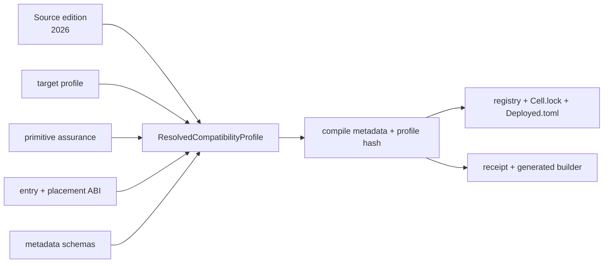

# CellScript Edition Policy

**Status**: Edition 2026 normative; Edition 2027 experimental on `0.26b`.

CellScript editions are long-lived source-language semantic epochs. An edition
answers one question: how should this CellScript source be understood? The year
in an edition label is an identifier, not an annual release schedule. Edition
2026 may remain current across multiple compiler release years.

The stable supported edition is:

```toml
[package]
edition = "2026"
```

`edition` is mandatory in every package manifest. A missing or unknown value is
an error. The `0.26b` implementation branch also recognizes `edition = "2027"`
as `cellscript-source-semantics-2027-preview4`. That preview is deliberately not
the current default, accepted grammar, migration promise, or 1.0 release
contract. It has a separately routed frontend, requires explicit sources for
transaction-facing parameters, rejects ambiguous `consume`/`consume_each`, and
initially emits only `SingleEntry` artifacts. Its implemented native subset is
specified in [the Edition 2027 preview grammar](CELLSCRIPT_2027_PREVIEW_GRAMMAR.md).

`cellc migrate --to 2027` is a bounded review tool, not a migration promise.
It recognizes only the self-contained legacy Type/Lock shapes with a total
mapping to preview4, preserves source outside the final entry, and emits no
candidate unless `CoreSemanticId` and RISC-V ELF bytes match. It never changes
`Cell.toml`, `Cell.lock`, deployment state, or source files by default.

## What The Edition Owns

An edition owns rules that can change the meaning of the same source text:

- keywords, reserved words, and resolution of syntactic ambiguities;
- name resolution, scope behavior, and the default prelude;
- type checking, inference defaults, coercions, and flow/resource rules;
- desugaring and other source-observable semantics; and
- edition-specific deprecation diagnostics and migration lints.

Edition 2026 identifies those rules as `cellscript-source-semantics-2026` and
keeps its legacy frontend path frozen. Edition 2027 preview uses the distinct
`cellscript-source-semantics-2027-preview4` route. Both currently lower through
the shared checked AST/IR into typed-semantics v4 and may have identical
`CoreSemanticId` values for the explicitly equivalent subset. Preview4 admits
one final native `type_script` or `lock_script` container; it does not admit
both in one source module. Its bounded Type Script surface distinguishes
successor, fixed-role pooled accounting, retirement, and fresh output origin,
and its `audit` surface is metadata-only by construction.

Additive syntax, diagnostics, formatter improvements, and optimizer changes do
not require a new edition when existing source keeps its meaning. A new edition
is justified only when an intentional source-semantic break cannot be handled
by an additive feature, a warning/deprecation cycle, or an independently
versioned schema or ABI.

## Independent Compatibility Axes

The edition does **not** own the compiler release, target profile,
primitive-assurance mode, metadata schemas, or CKB wire ABIs. The compiler
assembles those independently versioned values with the source edition into a
resolved compatibility profile:

| Axis | Current `0.26b` value |
|---|---|
| Source edition | stable `2026`; experimental `2027` |
| Source semantics | `cellscript-source-semantics-2026` or `cellscript-source-semantics-2027-preview4` |
| Compiler release | workspace SemVer (`0.x.y`), recorded separately |
| Target profile | selected independently, normally `ckb` |
| Primitive assurance | selected independently, or `default` |
| Payload ABI | `cellscript-entry-witness-v1` (`CSARGv1\0`) |
| Placement ABI | `cellscript-witnessargs-input-type-v2` |
| Metadata schemas | metadata 63, source 2, artifact 1, constraints 3 |

The compiler release is recorded next to the profile but is not part of the
profile itself. A compiler patch may change diagnostics or optimization
without changing compatibility. Conversely, an urgent wire-ABI or metadata
fix can advance its own version immediately without waiting for a new calendar
year or source edition.

For the current CKB placement profile:

| Contract | Value |
|---|---|
| Placement field | `WitnessArgs.input_type` |
| Witness source | `GroupInput#0`, then `GroupOutput#0` |
| Raw payload alias | rejected |

The resolved profile uses schema
`cellscript-resolved-compatibility-profile-v1`. It is emitted in compile
metadata and hashed into package, registry, lockfile, deployment, receipt, and
generated-builder identities. Changing any constituent axis changes the
profile identity even when source text and edition stay the same.



Registry records therefore retain both `edition` and
`compatibility_profile_hash`. The former tells source consumers how to read the
package; the latter commits to the complete compile/build contract. A registry
consumer must not infer target, primitive, ABI, or metadata versions from the
edition year.

## Why `CSARGv1` Still Exists

The source edition and `CSARGv1` solve different problems.

- `edition = "2026"` selects source-language meaning before a transaction
  exists.
- `CSARGv1\0` identifies CellScript positional-argument bytes while a CKB
  Script is executing.
- `cellscript-witnessargs-input-type-v2` identifies where those bytes are
  placed and how the script-group witness is selected.

The current compatibility profile combines all three identities. The old raw
placement form—putting `CSARGv1` directly in the witness instead of inside a
canonical `WitnessArgs.input_type`—is not accepted. It fails closed with
runtime error `25 entry-witness-abi-invalid` because the placement ABI says so,
not because calendar year 2026 intrinsically implies a witness layout.

## Persisted Format Boundary

The 0.23 line deliberately starts new persisted identities:

| Surface | Required identity |
|---|---|
| Compile metadata | metadata 57, source 2, artifact 1, constraints 2 |
| Compatibility profile | `cellscript-resolved-compatibility-profile-v1` with every independent axis |
| `Cell.lock` | version 2 |
| `Deployed.toml` | version 2 and `cellscript-deployed-v0.23-edition-2026` |
| Compile receipt | `cellscript-compile-receipt-v2` |
| Generated action builder | `cellscript-generated-action-builder-v0.23-edition-2026` |

Readers reject earlier versions. They do not silently fill edition/profile
fields or rewrite old files.

The 0.24 line advances only the lock carrier to version 3 with schema
`cellscript-lock-v0.24-graph-v1`. This is a dependency-resolution and source
identity change, not a new source edition: Edition 2026, the compatibility
profile, `Deployed.toml`, receipt, and generated-builder identities remain
independently versioned. Build/check/test reject older locks; only explicit
`cellc lock` or `cellc update` may repin them.

## API Boundary

Package compilation reads the mandatory edition from `Cell.toml`. APIs without
a package manifest must receive the edition explicitly:

- native metadata-only Rust APIs take `CellScriptEdition`;
- WASM exports take an edition string and accept `"2026"` plus the `0.26b`
  experimental `"2027"` value;
- browser workers pass `"2026"` explicitly; and
- LSP package compilation resolves the nearest package manifest.

`CompileOptions::default()` uses the current edition only for in-memory and
standalone compiler use. It is not a fallback for a package missing `edition`.

## Release And Evolution Requirements

Different axes have different closure requirements:

- source-semantic changes require a new edition plus parser, formatter, type
  checking, lowering, metadata, LSP, migration diagnostics, docs, and tests;
- entry or placement ABI changes require a new ABI identity plus codegen,
  builder, metadata, CKB-VM, `backend`, `dev`, and `ci` evidence;
- metadata changes require a schema bump plus every reader/validator update;
- target and primitive changes retain their own profile and gate contracts; and
- compiler-only compatible improvements use ordinary SemVer releases.

No edition is created merely because a year or compiler release changed.
