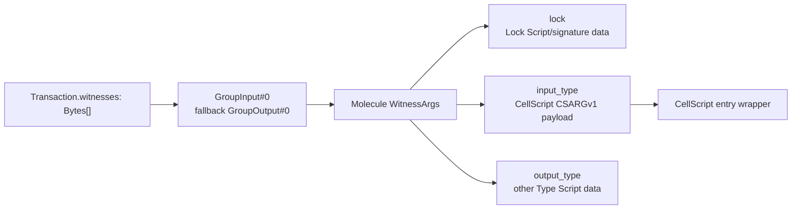

# CellScript 0.23.0 Release Notes

**Status**: Release notes for CellScript 0.23.0. The stable-release claim is
scoped to the exact `v0.23.0` tag after the full `release` gate passes.

**Updated**: 2026-08-11.

CellScript 0.23 makes its source semantics and compatibility axes explicit.
Edition 2026 is the first and only CellScript source-semantics epoch. The
independently versioned placement ABI gives CellScript entry arguments one
canonical location:
`WitnessArgs.input_type` on the selected script-group witness.

This document records completed 0.23 work. The public Registry infrastructure,
read/write domains, website, CLI read authority, and automatic compiler-backed
source-package evidence chain are deployed. General artifact, reproduction,
deployment, and commitment support is implemented in-tree, while canonical
Registry Script deployment and publisher-owned clean-machine adoption remain
checkpoints. Production mainnet commitments are disabled. The isolated Pudge
Sandbox commitment path is configured and live, but its testnet evidence is
not mainnet release evidence. Broader RGB++/Fiber evidence and the Off-Chain
Session Runtime profile remain roadmap work.

## At A Glance

| Area | What changes |
| --- | --- |
| Edition | Every package declares the long-lived source-semantics epoch `edition = "2026"`; no other edition, inference, or migration path is accepted. |
| Entry witness | `CSARGv1` is decoded only from canonical Molecule `WitnessArgs.input_type`. |
| Failure mode | Raw payloads, malformed tables, absent `input_type`, wrong placement, and mismatched identities fail closed. |
| Build identity | The resolved profile independently combines edition, target, primitive assurance, metadata schemas, and entry/witness ABIs, then binds them into metadata, registry, lock, deployment, receipt, and builder records. |
| Registry contract | The deployed publish contract requires Edition 2026 plus its compatibility-profile hash from CLI signature through API, Postgres, version-addressed JSON, and website; assurance states require ordered evidence. |
| Registry operations | `api.registry.cellscript.dev` and `registry.cellscript.dev` run as an isolated self-hosted Postgres/Node/object-volume/read-only-nginx stack behind trusted TLS. |
| Registry retry safety | Pre-admission failures release only the failed request's nonce and retry reservation; accepted metadata commits transactionally, and readiness covers the actual managed object prefixes. |
| Registry verification | Publish transactionally queues a leased, bounded real-compiler verification job; verified evidence/status commit atomically before crash-safe static-index convergence, and default search stays hidden until the baseline passes. |
| Registry authorisation | `cellc publish --authorise` creates a 15-minute exact-coordinate wallet session, stores the delegated P-256 key in the OS keychain, and resumes publishing after Registry approval. |
| Registry artifact profiles | CellScript dependencies, CKB executables, runtime verifiers, reproducible binaries, and copy-only templates share discovery but retain different resolver, TCB, deployment, and copy contracts. |
| Registry reproducibility | Reproducible profiles stay `evidence_required` until independent builder reports bind the signed environment, source, recipe, executable, and build logs. |
| Registry chain evidence | Mainnet deployment records are RPC-checked; configured Registry Type/Lock Scripts produce wallet transaction intents and a bounded Type-Script indexer reconciles live commitments without erasing history. |
| Registry environments | Production mainnet commitment readiness currently reports `disabled`; the separate Pudge Sandbox reports `configured_and_live` and retains only ephemeral testnet Registry records. |
| Production HTTP boundary | API/static JSON responses use HSTS, deny-all content policy, anti-framing, no-sniff, and restrictive browser permissions; the website ships a reproducible read-only nginx deployment with health checks and bounded logs/temp storage. |
| Registry install policy | Explicit unverified/quarantined install acknowledgements persist per dependency, so lock refresh and subsequent builds retain the same auditable risk choice. |
| Tooling | CLI, LSP, WASM, website bindings, examples, and package tooling use the same edition contract. |
| Syntax audit | Canonical type fields use trailing commas, checked examples use named `u64` boundaries, and compatibility plus CKB-VM regressions cover both source and witness placement. |
| Native gate | Active test, fixture, evidence, and release tooling is Rust, shell, or Node; repository policy rejects Python source reintroduction. |

## Edition 2026

`Cell.toml` now requires:

```toml
[package]
edition = "2026"
```

Edition 2026 selects source-language semantics rather than acting as an annual
compiler release or complete ABI bundle. It owns rules that could change the
meaning of the same source: syntax ambiguities, name resolution, typing and
coercion, desugaring, flow/resource semantics, and migration diagnostics.

The resolved compatibility profile separately composes:

- source-language semantics;
- target-profile behavior;
- primitive-assurance mode;
- entry-payload encoding; and
- CKB witness placement and script-group source;
- metadata, source, artifact, and constraints schema versions.

Compiler SemVer remains another independent identity. Compatible diagnostics,
formatter, optimizer, and additive-language work can ship in ordinary compiler
releases. Wire ABIs and metadata schemas can also advance without waiting for a
new calendar year. A new edition is reserved for an intentional break in the
meaning of existing source.

The resolved profile is emitted in compile metadata. Its hash is required by
registry build records, `Cell.lock` version 2, `Deployed.toml` version 2,
compile receipts, and generated action builders. Verification rejects a
missing or mismatched profile instead of guessing.

There is intentionally no compatibility or migration layer. Edition 2026 is
the first CellScript edition contract, and there is no published package
ecosystem that requires another interpretation.

## Canonical WitnessArgs Entry ABI

CKB transaction witnesses remain raw byte arrays at the transaction layer.
CellScript now requires the selected bytes to encode the standard Molecule
`WitnessArgs` table:

```text
WitnessArgs {
    lock:        BytesOpt,
    input_type:  BytesOpt,  // CellScript CSARGv1 entry payload
    output_type: BytesOpt,
}
```

The generated entry wrapper loads `GroupInput#0`. If the active script group
has no input, it loads `GroupOutput#0`. It validates the `WitnessArgs` table and
its `BytesOpt` offsets, extracts `input_type`, checks the `CSARGv1\0` magic, and
only then decodes positional arguments.



Placement ABI `cellscript-witnessargs-input-type-v2` does not accept `CSARGv1`
as a raw witness alias. A raw payload, malformed Molecule table, missing
`input_type`, or payload in `lock` or `output_type` fails with runtime error
`25 entry-witness-abi-invalid`.

Generated builders parse or create `WitnessArgs`, preserve `lock` and
`output_type`, and refuse to overwrite an occupied `input_type`. This keeps
CellScript arguments separate from Lock Script signatures and from another
Type Script's output-side data while remaining compatible with CKB's shared
witness convention.

## Persisted Format Boundary

The 0.23 identity set is:

| Surface | Required identity |
| --- | --- |
| Compile metadata | metadata 57, source 2, artifact 1, constraints 2 |
| Compatibility profile | `cellscript-resolved-compatibility-profile-v1` with independent source/target/assurance/ABI/schema axes |
| `Cell.lock` | version 2 |
| `Deployed.toml` | version 2 and `cellscript-deployed-v0.23-edition-2026` |
| Compile receipt | edition and resolved compatibility profile |
| Generated action builder | `cellscript-generated-action-builder-v0.23-edition-2026` |
| Registry build record | edition and compatibility-profile hash |
| `registry.json` / public publish | one required entry shape with explicit edition, profile hash, status, dependencies, and yank state |

Consumers reject other identities. Rebuild the artifact and regenerate its
metadata, lock/deployment records, receipt, and builder together.

The production Registry was deployed on 2026-07-31. Its
`0001_initial.sql` is now the frozen deployed baseline; subsequent schema work
requires additive numbered migrations. The write API accepts one complete
signed nested entry instead of an untyped or incomplete JSON object, persists
edition/profile as typed columns, and repeats them in version-addressed static
JSON. Generic admin status changes may quarantine, yank, deprecate, or move an
entry through indexing, but cannot label it `verified_build`, `deployed`, or
`on_chain_committed`. The ordered evidence-promotion endpoint validates
identity-bound evidence and the preceding evidence reference for each of those
states.

The first additive migration, `0002_verification_jobs.sql`, closes the gap
between the API's `verification: queued` response and actual execution. Publish
admission inserts the job in the same transaction as the version. A separate
least-privilege worker claims jobs with Postgres `SKIP LOCKED` leases,
authenticates the generated snapshot, compiles it with the current CellScript
compiler, verifies canonical manifest and resolved-profile identities, and
atomically records `verified_build` evidence. Static version JSON is refreshed
after that commit; lease recovery resumes only static publication if the
evidence already exists. Three attempts, exponential delay, dead letters,
admin metrics/requeue, bounded process resources/output/time, and a worker
heartbeat in API readiness make the queue operationally fail-closed. Default
public list/search now shows only `verified_build`, `deployed`, and
`on_chain_committed`; direct URLs and explicit status filters preserve admitted
history.

Manifest hashes are now computed from recursively key-sorted canonical JSON.
This removes the previous cross-process nondeterminism caused by serializing
`HashMap` fields directly and gives the publisher and isolated verifier one
stable identity.

## General Artifact And Chain Evidence Closure

The public model no longer equates Registry discovery with `cellc install`.
Each release declares an artifact kind, profile, source language, and
consumption mode. Only `cellscript_source` plus `dependency` enters the package
resolver. A CKB executable is consumed through explicit artifact verification,
pinning, deployment, and CellDep commands; a runtime verifier is a declared TCB
input; and a template is copied without becoming an implicit dependency.

Reproducibility is now an evidence transition rather than a manifest adjective.
`cellc artifact reproduction-report` creates a P-256-signed builder report, and
`cellc artifact reproduction-evidence` verifies two to sixteen reports with
distinct builder IDs, public keys, and trust domains. Every report must use
`cellscript-reproduction-report-v2` and match the signed environment, source
hash, build-recipe hash, executable hash, build-log hash, and timestamp. The API
additionally binds each builder to `REGISTRY_REPRODUCER_POLICY_JSON` and
requires the configured minimum number of independent trust domains. The
Registry stores the canonical policy SHA-256 and acceptance threshold and binds
the promotion to the accepted `verified_build` evidence. Until
that promotion succeeds, a reproducible executable remains `evidence_required`
and cannot acquire deployment evidence.

For an RPC-verified mainnet deployment, the commitment endpoint computes the
canonical `cellscript-registry-commitment-v1` payload and compact
`CSREGv1 || commitment_hash` Cell data. When operators configure the canonical
Registry Type Script, commitment custody Lock, and both code CellDeps, the
endpoint also returns a mainnet-only wallet transaction intent. A compatible wallet supplies
capacity, inputs, change, fee, witnesses, signatures, and broadcast. Scheduled
maintenance scans exact Type Script matches through the CKB indexer and
reconciles current state: a matching sufficiently confirmed live Cell promotes
the release to `on_chain_committed`; a spent or immature commitment falls back
to `deployed`; and a stale deployment falls back to
`deployment_status = undeployed` (projected as `verified_build`). Disabling Script configuration
also clears current commitment pointers. Evidence remains append-only.

The canonical Registry Type Script implementation is tracked as an independent
`no_std` crate under `contracts/registry-type-script`, together with the exact
3,352-byte deployable ELF and its pinned Linux x86_64 builder image identity.
The canonical host rebuild must match that artifact byte-for-byte; other hosts
report their host artifact without making a cross-host reproduction claim.
CKB-VM tests always execute the tracked deployable bytes. Its Type args bind
the custody Lock Script hash, all group Cells must use that Lock, and creation
also requires a custody-locked input. Production configuration is rejected if
it drifts from the tracked code data hash or the standard mainnet secp
Lock/DepGroup.

This is an implementation boundary, not a claim that the canonical mainnet
Registry Scripts have already been deployed. Production chain commitment stays
disabled until all four Script/CellDep values are deployed, confirmed, and configured, and
the first real non-CellScript mainnet artifact is still an adoption/evidence
checkpoint.

## CLI, LSP, WASM, And Website

- Package commands read Edition 2026 from `Cell.toml`.
- LSP modules carry the edition through the same compiler path used by `cellc`.
- WASM metadata exports require an explicit edition argument and currently
  accept only `"2026"`.
- The playground worker and TypeScript declarations pass that edition into the
  WASM boundary and include it in compiler-output provenance.
- Registry list and dynamic detail pages read the live production API, display
  evidence plus each version's source edition and separate
  compatibility-profile hash, and use the checked-in fixture only as an
  explicitly labelled read-only mirror during API failure. The Coming Soon
  surface is removed.
- Submit separates artifact kind from source language instead of hard-coding
  Rust. Manage exposes isolated reproduction, mainnet deployment, and
  commitment command builders alongside publish, inspect, and availability;
  task-specific fields disappear when the task changes.
- `cellc publish --authorise` closes the first-publish loop: the CLI creates a
  short-lived exact-coordinate session, opens the matching Registry site, and
  resumes the same publish after wallet approval. `--no-open` supports remote
  or terminal-only environments, and the manual signing flow remains an
  explicit advanced path.
- `cellc auth namespace claim` and the submit page's **Claim namespace** action
  expose the namespace-ownership admission step required before a package's
  first public publish. Capability registration no longer appears to imply a
  claim that the write API never created.
- Production operations include dependency-aware readiness, bounded proxy and
  application request bodies, persistent Postgres/object volumes, and a daily
  systemd backup. The first backup passed SHA-256 checks plus non-destructive
  `pg_restore --list` and object-archive inspection.
- `cellc install` and `cellc update` use the public API's accepted status as
  their default registry authority, then download the immutable source snapshot
  and verify its SHA-256 descriptor, safe file paths, per-file BLAKE2b hashes,
  source hash, edition, and profile identity. The legacy
  `CELLSCRIPT_REGISTRY_URL` path remains an explicit Git/`registry.json`
  offline override.
- Entry-witness reports, ABI reports, action plans, and generated builders
  expose canonical `WitnessArgs.input_type` placement.
- NovaSeal core, agreement, and planned-profile devnet transaction constructors
  serialize their `CSARGv1` payloads as Molecule `WitnessArgs.input_type`
  instead of emitting the retired raw form.

## Native Tooling Closure

The 0.23 line also completes the removal of Python from active project tooling.
`cellscript-tools` owns gate, evidence, fixture, NovaSeal, Evolving-DOB, and CKB
acceptance logic; website data generation remains in tracked Node modules.
Every gate runs the native source-policy check, which rejects Python sources,
generated interpreter caches, and interpreter references in active tooling
source across the repository and initialized submodules.

Native fixture generation can read live reports from an explicit isolated
evidence root. Its integration tests therefore pass from a clean checkout and
cannot inherit stale `target/` reports from a developer machine.

This changes the tooling implementation, not the meaning of production
evidence. iCKB equivalence, NovaSeal pinning, stateful CKB scenarios, and
website/WASM checks retain their separate evidence boundaries.

## Syntax And Example Audit Closure

The 0.23 syntax audit found no reason to redesign actions, `verification`,
invariants, destruction policies, parameter sources, or registry namespaces.
It did close two checked-in consistency gaps:

- type declarations now use the formatter's canonical comma-terminated field
  form in `examples/language/canonical_style.cell`; the parser still accepts
  comma-free fields as compatibility input;
- syntax-combination quick, CI, and deep modes require both canonical and
  compatibility field seeds;
- atomic-swap, NFT, timelock, and multi-phase-DAO examples and their package
  mirrors define `U64_MAX` locally and express overflow guards as named
  arithmetic; and
- `dev` and `ci` reject formatter drift and reintroduction of the cleaned raw
  boundary literals.

The merge-readiness pass also exposed four crypto-primitive CKB-VM fixtures
that still supplied raw `CSARGv1` witnesses. They now use the adapter's
placement ABI v2 path and keep the runtime's error-25 rejection of raw or
malformed entry witnesses intact.

## Deliberate Boundaries

CellScript 0.23 does not claim:

- that witness bytes are authority without explicit signature and key binding;
- that `input_type` is the input Cell's Type Script;
- that compiler success proves transaction construction, capacity, dry-run,
  tx-pool, commitment, or liveness;
- that `CSARGv1` replaces Molecule or CKB `WitnessArgs`; or
- stable-release readiness from `dev` or `ci` alone.

## Validation Commands

Routine local validation:

```bash
./scripts/cellscript_gate.sh dev
```

Merge-readiness validation:

```bash
./scripts/cellscript_gate.sh ci
```

The syntax-audit closure is additionally covered by the canonical formatter
check, the syntax-combination matrix, the bundled example tests, and the
`crypto_primitives` CKB-VM integration test included in these unified gates.

ABI and generated RISC-V validation:

```bash
./scripts/cellscript_gate.sh backend
```

Production release evidence:

```bash
./scripts/cellscript_gate.sh release
```

The `backend` stateful portion and both release modes require a clean tree and
their documented external dependencies. A passing lighter gate must not be
reported as release evidence.

Deployed Registry liveness and public read verification:

```bash
curl --fail --silent --show-error https://api.registry.cellscript.dev/ready
curl --fail --silent --show-error 'https://api.registry.cellscript.dev/v1/artifacts?limit=5'
curl --fail --silent --show-error https://registry.cellscript.dev/health
curl --fail --silent --show-error https://cellscript.dev/registry/ > /dev/null
curl --fail --silent --show-error https://api.testnet.registry.cellscript.dev/ready
```

On 2026-08-11, the production `/ready` endpoint reported
`registry_environment = production`, `ckb_network = mainnet`, and
`registry_commitment = disabled`. The Pudge Sandbox endpoint reported
`registry_environment = testnet-sandbox`, `ckb_network = testnet`, and
`registry_commitment = configured_and_live`. This is a live configuration and
liveness observation, not proof of a mainnet commitment or permission to
transfer testnet evidence into production.

On 2026-07-31, a disposable cryptographically valid WebAuthn-shaped P-256
fixture completed capability registration, namespace claim, signed publish,
same-request idempotent replay, static snapshot reads, a fresh-directory
install/check/build, capability revocation, and rejection of a later publish.
Its exact database and live object records were removed after the test; the six
object files remain in the server's isolated recovery directory rather than the
served object volume.

On 2026-08-01, an isolated production Compose topology completed a real
`cellc publish` through transactional queue admission, leased snapshot
authentication and compilation, evidence persistence, `verified_build`,
default-list visibility, and the version-addressed static object. The exact
containers, volumes, package rows, objects, and test credential were removed
afterward. This is deployment-mechanics evidence, not publisher-owned JoyID
evidence.

The same automatic pipeline was then deployed to the live production topology
from CellScript commit `4b1fdeec`. An explicitly seeded one-time smoke
principal/capability/namespace completed external `cellc publish`, worker claim,
real compilation, atomic evidence promotion, static convergence, default-list
visibility, and a fresh consumer install/check/build without
`--allow-unverified`. The exact database records were deleted transactionally;
the two test objects were removed from the served volume and retained only in
a checksum-verified recovery directory. All queue counts returned to zero, all
four production containers remained healthy, and a checksum-verified backup
captured the migrated, cleaned state. This proves the live worker boundary but
still does not substitute for publisher-owned JoyID authorisation.

The final production hardening pass makes the website deployment itself a
tracked artifact instead of server-local configuration. Its nginx container
runs read-only with bounded writable tmpfs mounts, health checks, log rotation,
and `no-new-privileges`; the website, API, and static Registry preserve HSTS,
anti-framing, no-sniff, cross-domain-policy, referrer, and permissions headers
through the shared TLS proxy. JSON-only Registry responses additionally carry a
deny-all content security policy.

The post-migration backup is also restore-tested, not only checksum-tested. An
isolated Postgres 17 container restored both numbered migrations and all seven
core Registry tables, while an isolated object volume accepted the complete
archive. Neither restore target shared the production database, object volume,
network endpoint, or lifecycle; both temporary targets were removed after the
drill.

These endpoints prove the deployed service boundary, not a publisher-owned
JoyID signature or first-package install. That interactive positive flow
remains the explicit adoption checkpoint.

## Detailed Documentation

- [CellScript Edition Policy](../CELLSCRIPT_EDITION_POLICY.md)
- [Entry Witness ABI](../CELLSCRIPT_ENTRY_WITNESS_ABI.md)
- [Package provenance and deployment identity](../CELLSCRIPT_PACKAGE_PROVENANCE_AND_DEPLOYMENT_IDENTITY.md)
- [CKB target profiles](../wiki/Tutorial-05-CKB-Target-Profiles.md)
- [Metadata verification and production gates](../wiki/Tutorial-06-Metadata-Verification-and-Production-Gates.md)
- [0.23 roadmap](../../roadmap/CELLSCRIPT_0_23_ROADMAP.md)
- [Changelog](../../CHANGELOG.md)
