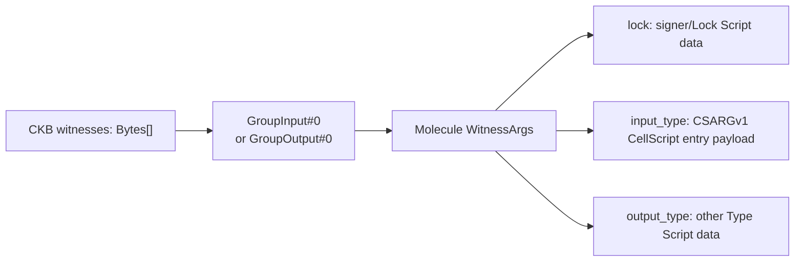

# CellScript 0.23 Roadmap

**Status**: Implementation scope frozen on 2026-08-09; stable release and
production CKB claims still require their documented clean-tree gates and
external evidence
**Scope**: one Edition 2026 source-semantics epoch, an independently resolved
compatibility profile, canonical CKB
`WitnessArgs.input_type` entry placement, public registry production deployment
on `cellscript.dev`, completed native test/fixture tooling, and the bounded
Fiber/RGB++ evidence actually obtained on this line
**Depends on**: the 0.22 typed transaction views, bounded collections, stable
`E2xxx` diagnostics, the existing `cellscript-fiber-adapter` no-profile path,
the implemented `services/registry-api` write boundary, the production
boundary ADR, and the Myelin Session L2 plan

## Goal

0.23 is the first CellScript release line whose headline is *operational* rather
than language-theoretic. 0.22 closed the first slice of the type/set roadmap
and the bounded Fiber path; 0.23 turns those compiler facts into a running
public package registry, drops Python from the project's tooling contract, and
preserves the bounded Fiber/RGB++ path without overstating incomplete external
evidence.

The four original pillars below were independent planning packages. The final
scope adopts the first two, preserves only the bounded completed slice of the
third, and retires the fourth. They share one discipline: every claim remains
tied to compiler evidence or builder-backed chain evidence, and every
"production" word distinguishes *deployed and observed* from *gated and
certified*.

This file preserves the original four-pillar plan and records the final scope
decision below. It must be read with `CHANGELOG.md`, the 0.23 release notes, and
the release gate; historical planned text is not evidence that a deferred item
shipped.

## Final Scope Decision (2026-08-09)

The 0.23 implementation boundary is frozen around the work that is present and
gated in this repository:

- Edition 2026, the resolved compatibility profile, metadata schema 57,
  canonical `WitnessArgs.input_type` placement, and the persisted identity cut;
- the deployed public Registry read/write/source-package verification slice,
  generalized artifact/reproduction/deployment/commitment support, the
  publisher browser-session flow, and the isolated Pudge sandbox;
- the Rust/shell/Node native tooling boundary and repository source policy;
- the content-addressed bounded Fiber evidence/adapter improvements actually
  recorded by the release line; and
- the website, Wiki, release-note, and toolchain freshness closure enforced by
  `dev` and `ci`.

Three categories are deliberately not relabelled as completed 0.23 work:

1. Deploying the canonical Registry Scripts on CKB mainnet, spending a real
   publisher wallet, and publishing the first real non-CellScript commitment
   need operator authority, funds, wallet approval, public-chain transactions,
   confirmations, and configuration readback. They remain external operational
   checkpoints rather than local implementation tasks.
2. The complete pinned Fiber lifecycle/negative matrix and protocol-level
   RGB++ promotion remain external evidence work. Representative devnet rows do
   not close those matrices.
3. The proposed Off-Chain Session Runtime compiler profile is retired rather
   than shipped. Current Myelin no longer vendors CellScript: it invokes an
   independently versioned compiler process through an attested adapter,
   compiles production requests under `ckb`, keeps scheduler plans as sidecar
   evidence, and forces `CkbStrict` for session/court paths. Moving
   `MyelinExtended` semantics into CellScript would weaken that separation.

The independent artifact checker, executable package tests, source maps,
Myelin adapter handoff, and conditional Fiber/RGB++ promotion are specified in
the [0.24 roadmap](CELLSCRIPT_0_24_ROADMAP.md). This scope decision follows the
risk register's existing permission to cut the CellScript release when Myelin
or external evidence slips; it does not claim that the deferred evidence
passed.

## Completed Release-Line Foundation: Source Edition And Compatibility Axes

Before the four operational pillars, 0.23 closes two compiler-wide contracts
that every later package and builder depends on.

### One Edition Contract

Edition 2026 is the first and only CellScript edition. Every package declares
`edition = "2026"`; missing or different values fail during manifest parsing.
There is no migration command, implicit alternate edition, or compatibility
parser because no published CellScript ecosystem needs one. `2026` is a
long-lived source-semantics epoch label, not a promise to mint one edition per
year.

The edition owns source-language meaning: syntax ambiguity, name resolution,
type/coercion behavior, desugaring, and source-observable semantics. Target
profile, primitive assurance, entry-payload encoding, CKB witness placement,
metadata schemas, and compiler SemVer are independent version axes. The
compiler composes all compatibility-relevant axes except compiler SemVer into
`cellscript-resolved-compatibility-profile-v1`, emits it in metadata, and
hashes it into registry records, `Cell.lock`, `Deployed.toml`, compile
receipts, and generated action builders. A tool cannot change one axis while
continuing to claim the same build identity.

The same edition value crosses every compiler consumer:

- CLI package commands read it from `Cell.toml`;
- standalone and in-memory compiler calls use the current edition explicitly;
- LSP-loaded modules carry the edition into compilation;
- WASM exports require the caller to pass `"2026"`; and
- the website worker and generated TypeScript bindings pass and report the same
  value.

### Canonical Entry Witness Placement

The entry payload keeps the self-identifying `cellscript-entry-witness-v1`
format (`CSARGv1\0` plus positional arguments). The independently versioned
placement ABI gives it one CKB location:



The generated entry wrapper first loads `GroupInput#0`; for an output-only
script group it uses `GroupOutput#0`. It validates the Molecule table and the
`BytesOpt` field before decoding `input_type`. A raw `CSARGv1` payload, malformed
table, absent `input_type`, or payload placed in `lock`/`output_type` fails
closed with runtime error 25. Builders preserve the other two fields and reject
an occupied `input_type` instead of silently overwriting it.

This removes the former ambiguity between two byte layouts without inventing a
CellScript-specific replacement for CKB's shared Witness convention.

### Persisted Identity Cut

Because no ecosystem migration is required, 0.23 accepts only the new identity
set:

- compile metadata schema 57 with source schema 2, artifact schema 1, and
  constraints schema 2;
- `Cell.lock` version 2;
- `Deployed.toml` version 2 with
  `cellscript-deployed-v0.23-edition-2026`;
- edition-bound compile receipts and generated action builders; and
- registry build records with a required compatibility-profile hash.

Readers reject missing, mismatched, or superseded identities. They do not
infer ABI or metadata versions from Edition 2026.

### Acceptance Boundary

The foundation is complete only when manifest parsing, compile metadata,
artifact verification, registry resolution, lock/deployment checks, CLI, LSP,
WASM, website bindings, entry-wrapper codegen, builders, examples, and docs all
agree. Valid and invalid CKB-VM fixtures must cover canonical
`WitnessArgs.input_type`, malformed offsets, absent fields, raw-payload
rejection, and output-only group selection. NovaSeal live and planned-profile
devnet constructors must use the same placement rather than maintaining a
release-only raw-witness path. Routine merge evidence is `dev` and `ci`; because
witness placement changes generated RISC-V, the clean-tree `backend` gate
remains required before a production claim.

The 2026-07-31 syntax audit also closed the source-level consistency slice of
this foundation:

- comma-terminated type fields are the formatter's canonical output, while
  comma-free fields remain accepted compatibility input;
- quick, CI, and deep syntax-combination matrices require both field forms;
- the checked atomic-swap, NFT, timelock, and multi-phase-DAO example pairs use
  local `U64_MAX` constants instead of opaque maximum or `MAX - delta`
  literals; and
- CKB-VM crypto primitive fixtures place `CSARGv1` in
  `WitnessArgs.input_type`, so they exercise placement ABI v2 rather than the
  retired raw-witness alias.

The `dev` and `ci` gates enforce the canonical example and integer-boundary
rules. This closure does not add syntax, relax the entry ABI, or expand the
production example matrix.

Source documents:

- [0.23 development release notes](../docs/releases/CELLSCRIPT_0_23_RELEASE_NOTES.md)
- [CellScript Edition Policy](../docs/CELLSCRIPT_EDITION_POLICY.md)
- [Entry Witness ABI](../docs/CELLSCRIPT_ENTRY_WITNESS_ABI.md)
- [Metadata verification tutorial](../docs/wiki/Tutorial-06-Metadata-Verification-and-Production-Gates.md)

## Pillar 1: Public Registry Production Deployment

**Status (2026-08-02): production infrastructure, public reads, website, CLI
resolution, evidence promotion, and the bounded automatic source/build
verification pipeline are implemented and deployed. The generalized artifact,
independent reproduction, mainnet deployment, and configured chain-commitment
paths are implemented in-tree. Production chain commitment is not active until
the canonical Registry Type Script, commitment custody Lock, and both code
CellDeps are deployed, sufficiently confirmed, and configured. A publisher-owned wallet publication, a real
non-CellScript mainnet artifact, and clean-machine consumption remain adoption
checkpoints.**

The canonical Registry Type Script source, reproducible release identity,
CKB-VM lifecycle/authorization tests, and production configuration pinning are
now implemented in-tree. The unchecked item below is specifically the external
mainnet transaction, confirmation, and operator configuration checkpoint.

The registry is the largest 0.23 feature. The write API
(`services/registry-api`) implements the boundary described in
[`docs/CELLSCRIPT_REGISTRY_PRODUCTION_BOUNDARY_ADR.md`](../docs/CELLSCRIPT_REGISTRY_PRODUCTION_BOUNDARY_ADR.md):
wallet-rooted JoyID or CKB secp256k1 capability authorisation, scoped capability
keys, namespace claim
cooldown, content-addressed source snapshots, Postgres state, a separate static
`/packages/*` read path, idempotent publish, admin-gated suppressive
transitions, and evidence-gated assurance promotion.

The Edition 2026 plus resolved-profile contract slice is complete across the
Rust publisher/reader, API validation, deployed Postgres schema,
version-addressed package JSON, checked-in registry fixture, and website data
model. These surfaces accept one complete entry shape; there is no fallback
reader for omitted fields. Generic admin status changes cannot create
`verified_build`, `deployed`, or `on_chain_committed` claims. The ordered
`/promote` endpoint requires identity-bound evidence for each transition.

### Production Domains And Hosting

```text
cellscript.dev                -> Astro static site + WASM playground
registry.cellscript.dev       -> read-only nginx over the Registry object volume
api.registry.cellscript.dev   -> Node 22 Registry API + Postgres 17
HTTPS                          -> shared HTTPS Portal with persisted ACME state
```

All three public hosts are live on the production server. The API/database use
an isolated internal network; only the API and static read container join the
existing TLS proxy network. Source snapshots and package JSON share a
persistent volume, mounted read/write by the API and read-only by nginx.
Ordinary direct package reads therefore do not touch Postgres or the write
process. The Cloudflare Worker/Hyperdrive/R2 implementation remains a portable
alternative deployment, not a claim about the current topology.

### Scope

- [x] Deploy `services/registry-api` with generated database/admin secrets,
  persistent Postgres/object volumes, migrations, health checks, bounded
  request bodies, read-only root filesystems, structured logs, and log rotation.
- [x] Serve version-addressed `/packages/*` JSON from a read-only process
  independent of the API and Postgres.
- [x] Publish trusted TLS for `registry.cellscript.dev` and
  `api.registry.cellscript.dev`; configure the API vhost for the publish
  contract's 8 MiB proxy limit.
- [x] Wire the Astro Registry list and dynamic detail pages to the live API,
  remove Coming Soon, and label the checked-in fixture strictly as a read-only
  mirror used only when the API is unavailable.
- [x] Keep the CCC wallet submit page on the same canonical
  `cellscript-registry-auth-v1` capability protocol.
- [x] Expose namespace ownership as an explicit first-publish step through
  `cellc auth namespace claim` and the submit page, matching the deployed
  `/v1/namespaces/claim` admission boundary.
- [x] Implement and expose public search/detail/evidence reads plus ordered
  evidence promotions.
- [x] Make publish admission enqueue a transactional verification job; claim it
  with Postgres leases and `SKIP LOCKED`; authenticate and compile the immutable
  snapshot in a bounded, least-privilege worker; atomically promote it to
  `verified_build`; converge the static version object; and expose queue
  metrics, dead letters, and audited manual requeue.
- [x] Keep unverified versions available by direct URL and explicit status
  query, while limiting the default public list/search and resolver to
  `verified_build`, `deployed`, and `on_chain_committed`.
- [x] Separate CellScript dependencies, deployable CKB executables, runtime
  verifiers, reproducible binaries, and copy-only templates with closed
  artifact/profile/language/consumption contracts across API, CLI, verifier,
  website, and immutable bundles.
- [x] Require independent `reproduced_build` reports before a reproducible
  artifact can become verified or acquire deployment evidence.
- [x] Generate wallet-ready Registry commitment intents, scan exact configured
  Type Script matches, and reconcile spent commitments or stale deployments
  without deleting historical evidence.
- [ ] Deploy and configure the canonical mainnet Registry Type Script,
  commitment custody Lock, and both code CellDeps; then publish and commit the first real non-CellScript
  mainnet artifact.
- [ ] Complete a publisher-owned wallet capability, namespace claim,
  publication, replay, revocation, and first clean-machine install against
  production.

### CLI Alignment

- Make bare `cellc publish` hit the production write API by default, while
  keeping `--offline` and the Git/`registry.json` path as explicit audit and
  fallback modes.
- Verify `cellc auth capability create/submit/revoke` against the deployed
  write service end to end, including JoyID and CKB secp256k1 signature
  verification, capability-key persistence in the OS keychain, and CI signing via
  `CELLSCRIPT_CAPABILITY_PRIVATE_KEY_PKCS8_B64`.
- Confirm idempotency (`Idempotency-Key`, `x-idempotency-status: replayed`),
  request-owned nonce release on pre-admission failure, transactional admission,
  and the fail-fast-before-object-storage rule against the live write service.
- `cellc install`/`cellc update` now query
  `api.registry.cellscript.dev` by default, select only accepted public
  statuses, then download the version's immutable Registry snapshot and verify
  its SHA-256 descriptor, per-file BLAKE2b hashes, safe paths, edition/profile,
  and whole-tree source hash. `CELLSCRIPT_REGISTRY_URL` remains the explicit
  legacy Git/`registry.json` offline authority override.

### Acceptance Boundary

Production-readiness evidence for the already deployed source-package slice
currently proves:

- all API type checks and 42 admission/state-machine tests pass locally;
- the independent Rust verifier compiles a generated snapshot with the real
  compiler and rejects source, manifest, and compatibility-profile drift;
- an isolated production Compose topology completed a real `cellc publish` from
  queue admission through leased compilation, evidence persistence,
  `verified_build`, default-list visibility, and static-object publication;
- the live production topology repeated that path from external `cellc publish`
  through real compiler verification and a fresh consumer install/check/build
  without `--allow-unverified`; the explicitly seeded smoke identity and its
  served rows/objects were removed afterward;
- live health/readiness checks cover Postgres, the object volume, runtime, and
  admin configuration;
- the website has a tracked read-only nginx/Compose deployment, and all three
  public surfaces preserve their intended security headers through TLS;
- the proxy admits a 2 MiB body to application validation and the Node adapter
  rejects 7 MiB + 1 byte with a structured 413;
- unauthorised admin writes, invalid public queries, static POSTs, and traversal
  attempts are rejected;
- immutable snapshot descriptors are present in public/static version records,
  and the resolver fails closed on opaque archives, traversal, file-hash drift,
  object-hash drift, or source-tree drift;
- API restart recovery preserves the database, audit log, and object volumes;
- the daily systemd backup produces checksum-verified Postgres and object-store
  archives, and a post-`0002` backup captured the migrated, cleaned production
  state; an isolated Postgres 17/object-volume drill restored both migrations,
  all seven core tables, and the complete object archive;
- the website serves the live Registry and contains no Coming Soon surface.
- a cryptographically valid WebAuthn-shaped P-256 fixture completes capability
  registration, explicit namespace claim, signed publish, idempotent replay,
  API/static/snapshot reads, and a fresh-directory install/check/build against
  production; this proves deployment mechanics but is not publisher-owned
  JoyID evidence.

The remaining deployment checkpoints are intentionally concrete: complete a
positive publisher-owned wallet flow and install its first accepted source
package on a clean machine; then deploy/configure the canonical Registry
Scripts and exercise reproduction, deployment, commitment, index discovery,
and lifecycle demotion with a real mainnet non-CellScript artifact. Unit-test
signatures, transaction intents, or direct database seeding do not satisfy
those checkpoints.

The existing `services/registry-api` typecheck, unit suite, Node API/verifier
builds, dry-run Worker build, and the independent Rust verifier tests/clippy run
in the unified `ci` gate as the local contract baseline. `dev` checks the Rust
verifier crate. Deployed end-to-end coverage still belongs in a staging
scenario harness; local compiler CI is not evidence for either the self-hosted
runtime or the optional Cloudflare/R2/Hyperdrive/Neon adapter.

### Non-Goals

- No claim that a transaction intent is an on-chain commitment. Only a
  sufficiently confirmed live mainnet Cell matching the configured Registry
  Type Script, commitment Lock, exact commitment data, and both live code
  CellDeps can produce current `on_chain_committed` state.
- No Registry ownership of application business Cells. The Registry identifies
  code, build, TCB, deployment, and commitment evidence; application state Cells
  remain under their own Lock/Type Scripts and transaction protocols.
- No bond or refundable deposit mechanism; the schema leaves `policy_hooks`
  and `bond_policy_hooks` for later.
- No testnet Registry authorisation, deployment, or commitment state.
- No D1 as primary database.

Source documents:

- [Registry production boundary ADR](../docs/CELLSCRIPT_REGISTRY_PRODUCTION_BOUNDARY_ADR.md)
- [Registry Phase 1 walkthrough](../docs/CELLSCRIPT_REGISTRY_PHASE1.md)
- [Registry API service README](../services/registry-api/README.md)

## Pillar 2: Native Tooling Migration Complete

CellScript's load-bearing tooling is now Python-free. Gate, evidence, and
proposal logic lives in Rust; Astro-facing website data generation stays in
the website's native Node runtime.

### Implemented Scope

- `crates/cellscript-tools` owns strict backend and syntax-combination audits,
  repository checks, release validators, CKB acceptance, NovaSeal fixtures,
  external-evidence adapters, Fiber experiments, and live/stateful runners.
- `proposals/novaseal/tools` owns NovaSeal package-local vector, schema, ABI,
  audit-surface, and fixture harnesses.
- `proposals/evolving-dob/evolving-dob-profile-v1/tools` owns registry pressure
  and devnet workflow validation.
- `website/scripts/*.mjs` owns registry, compiler-output, and GitHub activity
  data generation without introducing a second runtime into the Astro build.
- `scripts/cellscript_gate.sh` invokes only Rust, shell, and Node tooling. The
  retired syntax-check arm and all tracked interpreter sources have been
  removed; a repository-wide native source policy prevents reintroduction.
- Evidence producers preserve their established JSON shape where it remains
  part of the release contract; implementation-origin fields now truthfully
  identify the Rust harness and transaction-recipe replay path.
- Profile-operator fixture generation accepts an explicit evidence root, and
  its integration coverage constructs isolated reports instead of depending
  on stale developer-machine files below `target/`.

### Acceptance Boundary

- `./scripts/cellscript_gate.sh dev` and `ci` pass with only the declared Rust,
  shell, and Node runtimes.
- Deterministic static reports remain byte-stable for the same inputs; live
  reports preserve their schemas while binding fresh devnet transactions.
- The NovaSeal verifier pinning check still recomputes BLAKE2b and SHA-256
  over the same ELF and compares against the same `Cell.toml` and
  `proofs/*.template.json` hashes.
- The proposal submodules keep their evidence roots intact; only the driver
  language changes.

### Non-Goals

- No rewrite of the compiler, the gate script's bash orchestration, or the
  CKB acceptance harness's bash wrappers. The migration changes the native
  tooling implementation, not those orchestration boundaries.
- No change to the evidence schema or file naming.
- No dropping of historical evidence files; the ports must keep reading
  them.

Source documents:

- [Coding style](../CODING_STYLE.md) — tooling and gate contract
- [Gate policy](../docs/CELLSCRIPT_GATE_POLICY.md) — mode semantics
- [`scripts/cellscript_gate.sh`](../scripts/cellscript_gate.sh)

## Pillar 3: RGB++ And Fiber Integration

**Final 0.23 disposition**: bounded adapter and content-addressed evidence
hardening is retained; the complete external Fiber matrix and RGB++ protocol
promotion move to the conditional evidence track in 0.24. This section records
the original target and the remaining boundary, not a claim that every item
below completed.

0.22 shipped a narrow, no-profile Fiber path: the dedicated
`fungible-type-group-v1` compiler entry, the `cellscript-fiber-adapter`, and
bounded local-devnet scenarios. Phase 5 (gate promotion and optional hot
loading) and the full external lifecycle/negative matrix remain pending.
0.23 does not declare Fiber production-ready; it closes the next set of
concrete integration gaps.

### Fiber Scope

- Close the pinned complete external lifecycle/negative matrix. The current
  evidence is bounded devnet runs (Fiber `04e091b...`, Bruno 1.20.0
  watchtower collection); the missing rows are the declared full matrix,
  not a representative sample.
- Promote the standalone Fiber harness (`scripts/cellscript_fiber_acceptance.sh`)
  from non-gating to a release-mode gate once the matrix is complete and
  reproducible. Until then it stays standalone.
- Address the restart-required operator burden: the adapter must continue to
  generate a deterministic overlay and report
  `LocalNodeConfiguredRestartRequired`. Any future hot-load RPC must be
  capability-detected and explicitly optional; no unsupported Fiber RPC is
  assumed.
- Extend the `fungible-type-group-v1` contract conservatively. Any new
  authority mode, witness shape, or data layout must keep the fail-closed
  diagnostic surface and must not silently widen the structural-compatibility
  predicate by name-matching (`token`, `transfer`, `fiber`, `amount`,
  `xudt`).

### RGB++ Scope

RGB++ stays outside `std::*`. 0.22 only shipped a non-production
`examples/ecosystem/rgbpp-identity-adapter`. 0.23 advances the ecosystem
adapter track from the [Spore/RGB++ interop plan](CELLSCRIPT_SPORE_RGBPP_INTEROP_PLAN.md):

- Pin RgbppLock, BtcTimeLock, BTC SPV, witness/commitment, confirmation, and
  deployment identities before any protocol-level promotion.
- Keep Bitcoin orchestration in the builder/service layer; the compiler
  surface continues to bind one transfer-shaped input/output pair to exact
  Type Script code hash, hash type, and args.
- Add CKB plus Bitcoin-side fixtures together; no Spore-over-RGB++ combined
  fixture until both independent adapters pass their own promotion gates.
- Treat the active `RGBPlusPlus/rgbpp-sdk` as the only normative source. The
  early design repository remains background, not ABI.

### Acceptance Boundary

- The Fiber full matrix is content-addressed: every completed row references
  a non-empty regular file under an explicit evidence root with its CKB
  Blake2b-256 digest; the validator rejects absolute paths, parent
  traversal, symlinks, missing files, and hash mismatches.
- Operator authentication and reproducible Fiber binary provenance remain
  separate release obligations; closing the matrix is necessary but not
  sufficient for a production-readiness claim.
- RGB++ work ships as a package/adapter slice, not as core namespace
  surface, and must carry reproducible external fixtures and reorg/finality
  assumptions before promotion.

### Non-Goals

- No Fiber-specific profile language (`fiber-profile.json`, `[fiber]` in
  `Cell.toml`, `#[fiber_asset]`, etc.). The no-profile rule from 0.22 is
  preserved.
- No embedding of the CellScript compiler into a Fiber node.
- No claim that the SHA-256 / SHA256d / Merkle helpers implement Bitcoin
  SPV. Header chains, PoW/difficulty, confirmations, and reorg policy belong
  to a separately pinned Bitcoin SPV package.

Source documents:

- [0.22 Fiber native-support plan](CELLSCRIPT_0_22_FIBER_NATIVE_SUPPORT_PLAN.md)
- [Spore/RGB++ interoperability plan](CELLSCRIPT_SPORE_RGBPP_INTEROP_PLAN.md)
- [Signature verifier ABI](../docs/CELLSCRIPT_SIGNATURE_VERIFIER_ABI.md)

## Pillar 4: Off-Chain Session Runtime Profile (Myelin Alignment)

**Final 0.23 disposition**: superseded and not implemented as a CellScript
target profile. Myelin's current repository has already removed the vendored
compiler architecture assumed by this proposal. Its `cellscript-adapter`
attests an independently versioned external compiler, production requests use
the CellScript `ckb` target, scheduler plans remain off-chain sidecars, and
session/court execution is Myelin-owned `CkbStrict`. The 0.24 handoff therefore
updates that adapter to the completed CellScript identity/checker boundary
without introducing `MyelinExtended` semantics into CellScript.

### Current Boundary

- CellScript owns source semantics, the `ckb` target contract, generated
  artifact/metadata identities, and scheduler access templates.
- Myelin owns its finite-session VM, authenticated state resolution, conflict
  hashes, scheduler plans, finality, DA, projection receipts, and the
  distinction between `CkbStrict` and `MyelinExtended` execution.
- Scheduler binding names are diagnostics. Myelin resolves every final
  conflict key from authenticated concrete Cells and validated type-script
  identity.
- Myelin compiler fixtures may live in Myelin, but compiler source and
  workspace crates do not.

### 0.24 Handoff

The next integration step is one explicit adapter-lock transition to the
completed Edition 2026, metadata/profile, and canonical witness identities,
followed by adoption of the independent artifact checker. No fallback reader,
raw-witness alias, off-chain compiler target, or general concurrency syntax is
added to make that transition easier.

Acceptance belongs to the 0.24 roadmap: the adapter must verify exact compiler,
source, artifact, metadata, source-map, lowering-record, and checker identities;
court-facing requests stay on `ckb`; and the same deterministic session
transition must retain consensus-independent state commitments with distinct
finality evidence.

Source documents:

- [Myelin Session L2 plan](https://github.com/Myelin-Labs/Myelin/blob/main/MYELIN_SESSION_L2_PLAN.md)
- [Myelin CKB semantic deviations](https://github.com/Myelin-Labs/Myelin/blob/main/MYELIN_CKB_SEMANTIC_DEVIATIONS.md)
- [Myelin production gate](https://github.com/Myelin-Labs/Myelin/blob/main/MYELIN_PRODUCTION_GATE.md)
- [0.22 type/set roadmap (session-type deferral)](CELLSCRIPT_0_22_TYPE_AND_SET_THEORY_ROADMAP.md)
- [0.24 roadmap](CELLSCRIPT_0_24_ROADMAP.md)

## Cross-Cutting Discipline

0.23 does not relax any existing project contract:

- Trailing-whitespace, native source-policy, and `git diff --check` gates still
  apply. Native tooling changes must re-run `cargo fmt` and fix whitespace.
- The website build still regenerates
  `website/src/data/registry-packages.json` and fails if it is dirty in the
  working tree; if the production registry changes what gets regenerated,
  commit the result.
- The wasm bundle size budget (600 KB gzip) still holds. Any compiler
  surface must be gated so the `wasm32-unknown-unknown` playground build does
  not pull native-IO or host-runtime concurrency dependencies. The retired
  Off-Chain Session Runtime proposal adds no 0.23 WASM surface.
- Release notes continue to separate highlights, scope boundaries,
  validation commands, and detailed docs. Roadmap promises stay out of
  `docs/` and in `roadmap/`.
- The `rust-version = "1.97.1"` pin, the exact-version dependency pins
  (`indexmap`, `clap`, `ckb-vm`, etc.), and the pinned toolchain are not
  bumped without coordinating with the release gate.

## Sequencing

The final 0.23 sequence is:

1. native tooling migration and source-policy enforcement;
2. Edition/profile/entry-ABI and persisted-identity closure;
3. public Registry infrastructure, automatic source verification, artifact
   evidence, publisher-session, Pudge, website, and documentation closure; and
4. bounded Fiber evidence hardening without promoting an incomplete external
   matrix.

The proposed Off-Chain Session Runtime profile is not inserted after those
steps. The current Myelin process-adapter architecture makes that compiler
surface unnecessary. Independent artifact verification, executable package
tests, source maps, the Myelin adapter handoff, and conditional Fiber/RGB++
promotion start from the 0.24 roadmap.

## Risk Register

- **Registry publisher adoption**. The self-hosted production stack and public
  read surfaces are live, but the first publisher-owned wallet package has not
  completed the positive publication/install loop. Mitigation: keep
  source-published entries out of default resolution, require the existing
  evidence chain, and do not replace the final interactive checkpoint with
  seeded database state.
- **Registry chain activation**. Transaction intent, Script-indexed discovery,
  and lifecycle reconciliation are implemented, but no public commitment may
  be claimed until the canonical mainnet Registry Type Script, commitment Lock,
  and both code CellDeps are deployed and pinned. Mitigation: leave all four
  settings absent, fail readiness on partial or immature configuration, and require a real live-Cell
  drill before marking the checkpoint complete.
- **Native tooling serialization drift**. A subtle difference in
  evidence-report formatting breaks historical comparisons. Mitigation:
  byte-identical output requirements, stable schemas, and regression vectors.
- **Off-Chain Session Runtime scope creep**. The proposed compiler profile
  would duplicate Myelin-owned VM/session semantics and blur court-facing CKB
  claims. Resolution: retire the profile proposal; keep production compilation
  on `ckb`, keep `MyelinExtended` inside Myelin, and harden the external adapter
  and independent checker boundary in 0.24.
- **Fiber full matrix never closing**. The matrix is large and depends on an
  external Fiber binary. Mitigation: keep the harness standalone and
  non-gating until the matrix is complete; release 0.23 with an explicit
  pending matrix rather than blocking on it.
- **Myelin handoff drift**. Myelin's current adapter lock still identifies an
  earlier reviewed compiler line while CellScript 0.23 changes edition,
  schemas, profile identity, and witness placement. Mitigation: do not add
  compatibility aliases to 0.23; coordinate one explicit adapter-lock and
  fixture transition under the 0.24 checker contract.

## Roadmap Discipline

This entry follows the same rules as the rest of the roadmap:

- completed work points to tests, release notes, or evidence reports;
- deferred work says why it is deferred;
- security-sensitive surface distinguishes data source from authority;
- CKB production claims distinguish compiler evidence from chain evidence;
- no feature is described as implemented until parser, type checking,
  lowering, metadata, LSP/editor behaviour, tests, examples, and docs agree
  on the same boundary.
